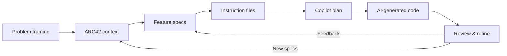

# 🔥 Let's BBQ

I'm building Let's BBQ as an AI-first .NET 10 playground to coordinate grill nights with friends while pressure-testing repeatable Copilot workflows. I want a clean slate where every instruction file, agent, and  spec is intentional so that I can stay in control even as AI takes on most of the execution. It also doubles as a modular-monolith lab where I can fine-tune module boundaries, dependency health, and solution-architecture concerns (resilience, observability, security) while staying current on Aspire, .Net 10 features, and the latest Copilot capabilities.

I intend to stay in the specification/documentation loop (ARC42 sections, feature briefs, instruction files) until it feels complete, then let Copilot execute the plan and feed the output back into the docs before moving on.

> ⚠️ **Disclaimer:** This approach is intentionally oversized for the application I intend to build here. In a real project of this size I'd pick a leaner blueprint and lighter governance, but here I'm attempting to learn how to use these techniques for enterprise-grade applications.

## 🎯 Goals

- Capture a reusable project template that bakes in AI-first guardrails.
- Craft a living set of Copilot instructions, prompts, and agent patterns.
- Feed ARC42 documentation (plus code-first diagrams) directly into Copilot sessions.
- Shape the domain as a modular monolith with explicit contracts and automated dependency checks so solution-architecture concerns are easy to slot in and measure.
- Dogfood .NET 10, Aspire, and GitHub Copilot together on a real BBQ coordination app.
- Create a modular-monolith sandbox where I can prototype cross-cutting capabilities—resilience, telemetry, security—that are hard to validate inside large enterprise codebases.

## 🧭 Current Status & Roadmap

I have the concept, early specs, and instruction-writing workflow defined; next up is turning that intent into working slices of the app.

- **Now**
  - Locking in the clean template plus repo instructions.
  - Drafting ARC42 context and solution strategy sections.
  - Pinning down domain boundaries and module seams.

- **Next**
  - Mapping domains into a modular-monolith skeleton, including allowed module dependency routes.
  - Generate the first API + UI slice via Copilot using the finalized instructions.
  - Wire up Aspire resources that back each module capability and surface dependency telemetry.

## 📚 Docs & Deep Dives

- [TODO: Link to the in-repo ARC42 documentation once the first draft lands.]
- [TODO: Link to markdown write-ups that explain sub-results, experiments, or blog-style findings.]
- [Copilot Plugins Tracker](./copilot-plugins.md)

## 🛠️ Tech Stack

Primarily .NET 10 with Aspire for distributed orchestration, GitHub Copilot (including agents) for assisted development, ARC42 for architecture documentation, and GitHub Projects to track experiments. The app will launch as a modular monolith backed by architectural tests and dependency visualizations so I can plug in solution-architecture capabilities—resilience, observability, security, performance—without tangling module boundaries, with Azure-hosted services once the backend solidifies.

## 🌐 Resources & Inspiration

- [ARC42 Template](https://arc42.org/overview) — keeps architecture thinking disciplined even when AI writes code.
- [.NET Aspire overview](https://learn.microsoft.com/dotnet/aspire/overview) — guidance on composing cloud-native resources that I can reuse here.
- [GitHub Copilot best practices](https://docs.github.com/copilot) — reference for structuring prompts, instructions, and agents before coding.
- [Modular Monolith Architecture](https://www.courses.milanjovanovic.tech/courses/enrolled/2518872) — course on enforcing clean module boundaries with explicit contracts.
